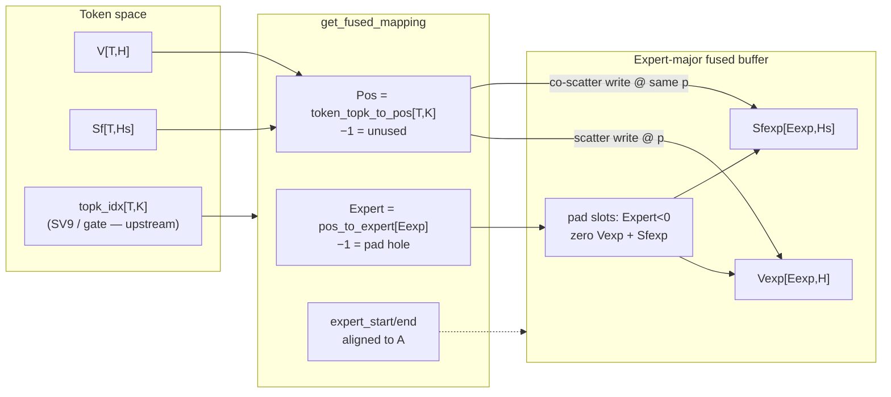
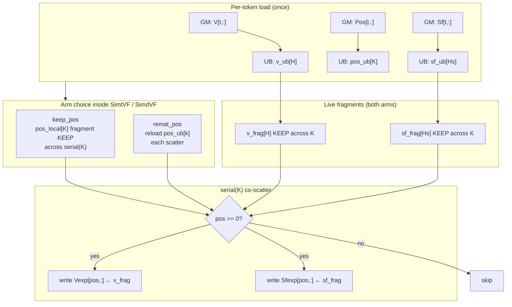
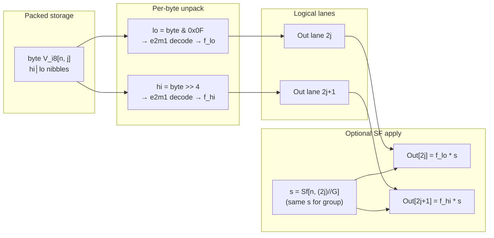

> **SUPERSEDED (2026-10-07).** Full SP1–SP6 single-axis contract + A5 bit-reinterpret e8m0 / soft-LUT split lives in
> [`ST_SP1_TO_SP6_ACCESS.md`](ST_SP1_TO_SP6_ACCESS.md). This file is historical design for SP1 + SP6 only
> (pre-PASS, soft-UE8M0-era notes). Soft Pow2 LUT in SP3 is **retired**; soft 4-bit e2m1 LUT stays under SP6 appendix.

# ST-SP1 / ST-SP6 — Packed-structure access patterns (design)

**Date:** 2026-09-28 ~14:28 HKT  
**Author target:** Lok Chan  
**Suite:** `/workspace/st_simtvf_parallel`  
**Status:** **Design only** — structs + diagrams + knobs. **No kernel implementation** this pass.  
**Do not touch:** CF7 / pto-b10 workstreams. Box-only (no PR push).

**Survey basis:** [`TILEKERNELS_PACKED_MOE_SURVEY.md`](TILEKERNELS_PACKED_MOE_SURVEY.md)  
**Contrast reports:** [`ST_SV4_INDEX_GATHER_PSUM.md`](ST_SV4_INDEX_GATHER_PSUM.md), [`ST_SV8_CASE3_BCAST.md`](ST_SV8_CASE3_BCAST.md), [`ST_SV9_TOPK_E2E.md`](ST_SV9_TOPK_E2E.md)  
**Twin contract (when implementing later):** [`ST_VMI_TWINS.md`](ST_VMI_TWINS.md)

---

## 1. Purpose

SP1 and SP6 probe **packed MoE / SFA-like scale+value access** that the current SV suite does not cover:

| Gap in SV suite today | What SP fills |
|-----------------------|---------------|
| SV4 gathers **values only** under an index | SP1 **co-scatters** `(V, Sf)` under the same `Pos` map |
| SV8 **computes** group scales then bcasts locally | SP1 **moves** a pre-packed sideband pair; SP6 **decodes** packed values then applies SF |
| SV9 builds **topk indices** only | SP1 **consumes** a fused map (`token_topk_to_pos`); no tournament CF |
| No FP4 / UE8M0 in ST | SP6 = value-pack decode (+ optional SF); SP3 (later) = SF-pack |

**Structural analogy (not a port):** TileKernels MoE `expand_to_fused_with_sf` + FP4 `e2m1` unpack is the same *shape* as Ascend **SFA gather/scatter of scale+value** (KV-cache-like slots): same index → same slot gets both payloads. TileKernels has no SFA/KV kernels; the analogy is **indexed co-movement of a packed pair**.

**Naming:** **SP** = Structure Pack (new family after SV/CF). Tags follow suite convention.

---

## 2. SP1 — Dual scatter `(V, Sf)` via `Pos`

**Stub name (later):** `sp1_dual_scatter_vsf`  
**TileKernels cites:**

| Role | Path |
|------|------|
| Co-scatter kernel | `tile_kernels/moe/expand_to_fused_kernel.py` — `get_expand_to_fused_kernel` / `expand_to_fused_with_sf` |
| Logical pack | `tile_kernels/quant/types.py` — `QuantTensor = tuple[torch.Tensor, torch.Tensor]` |
| Fused map + pad | `tile_kernels/moe/get_fused_mapping_kernel.py` — `get_fused_mapping` |
| Torch semantics | `tile_kernels/torch/expand_to_fused.py` |
| Tests matrix | `tests/moe/test_expand_to_fused.py` (`num_per_channels∈{32,128}`, packed UE8M0 + col-major) |

### 2.1 Structs / layouts

```text
# Logical packed activation (sideband — two tensors, one object)
QuantTensor = (data, sf)     # tile_kernels/quant/types.py

# Token-space inputs (per-token, pre-expand)
V   : Tensor[T, H]           # values (fp16/fp8/bf16 as used by producer)
Sf  : Tensor[T, Hs]          # scales; Hs = ceil(H / G); G = num_per_channels ∈ {32,128}
                             # dtype: fp32  OR  int32 (packed 4× UE8M0; then Hs' = ceil(Hs/4))

# Index map (from get_fused_mapping; ST may synthesize a fixed Pos table)
Pos : Tensor[T, K] int32     # token_topk_to_pos — Pos[t,k] = fused slot, or -1 = unused
Expert : Tensor[Eexp] int32  # pos_to_expert — Expert[p] < 0 ⇒ pad hole

# Expert-major fused outputs (aligned buffer)
Vexp  : Tensor[Eexp, H]      # same dtype as V
Sfexp : Tensor[Eexp, Hs]     # row-major sideband
        # OR col-major TMA: Sfexp_cm : Tensor[Hs, Eexp_pad] with Eexp_pad = align(Eexp, 4|16)
```

**Derived dims:**

| Symbol | Meaning | Typical ST knobs |
|--------|---------|------------------|
| `T` | num tokens | `{32,128}` |
| `K` | topk | `{2,8}` |
| `H` | hidden | `{128,512}` |
| `G` | channels per SF (`num_per_channels`) | `{32,128}` |
| `Hs` | `ceil(H/G)` (÷4 again if packed UE8M0) | derived |
| `Eexp` | fused buffer length (≥ live slots; pad for alignment) | derived / knob |
| `A` | expert alignment (pad slots) | `{8,16}` (SP4 later; SP1 may use fixed pad) |

**Gold (semantics, not kernel code):**

```text
for t in 0..T-1:
  for k in 0..K-1:
    p = Pos[t,k]
    if p >= 0:
      Vexp[p, :]  = V[t, :]
      Sfexp[p, :] = Sf[t, :]     # same p — co-scatter
for p in 0..Eexp-1:
  if Expert[p] < 0:
    Vexp[p, :]  = 0
    Sfexp[p, :] = 0              # pad zeros both tensors
```

### 2.2 Diagram A — token×topk → expanded positions



**10-line summary (Diagram A):**  
Tokens hold sideband `(V, Sf)`. Routing produces `topk_idx`; mapping builds `Pos[T,K]` and an expert-major buffer of length `Eexp` with aligned ranges. Each live `(t,k)` writes both tensors to the **same** fused index `Pos[t,k]`. Unused topk entries are `−1` (skip). Pad holes (`Expert[p]<0`) zero **both** value and scale. This is the MoE expand_with_sf shape — SFA analogy: one cache-slot index carries scale+value.

### 2.3 Diagram B — co-scatter under one index map + KEEP/remat arms



**10-line summary (Diagram B):**  
Load token row of `V`, `Sf`, and `Pos` into UB. Copy `V`/`Sf` rows into fragments that stay live across `serial(K)` (reuse payload for every topk slot). Arms differ only on **Pos**: `keep_pos` holds `pos_local[K]` in RF; `remat_pos` reloads from UB each `k` (SV4-style index remat). Predicated write: if `pos≥0`, store **both** fragments to fused row `pos`. Pad-zero of holes is a separate pass over `Expert` (or fused into the same kernel as TileKernels). Sensitivity = dual live fragments + index KEEP/remat tax.

### 2.4 Memory access pattern (GM / UB / RF)

| Stage | Who | Where | Notes |
|-------|-----|-------|-------|
| Ingest `V[t]`, `Sf[t]`, `Pos[t]` | MTE / copy | GM → UB | One token row each; `Pos` is `K` int32 |
| Optional pad-zero of hole rows | Parallel over `Eexp` | UB/GM `Vexp`/`Sfexp` | When `Expert[p]<0`; both tensors |
| `v_frag`, `sf_frag` fill | Parallel(H), Parallel(Hs) | UB → RF fragment | KEEP across `serial(K)` |
| `pos_local` (`keep_pos`) | load once | UB → RF | Live `K` int32 across K |
| `pos` (`remat_pos`) | load each k | UB → scalar/RF | No live Pos fragment |
| Scatter writes | Parallel(H/Hs) | RF → UB/GM fused | **Two** indexed stores per live k |
| Who remats Pos | ST arm | — | `remat_pos` only; map build is **out of scope** (Pos is IO / fixed table) |

**Predicted RF pressure (Simt T=32, illustrative):**

| tag sketch | live Pos | live V elems/thr | live Sf elems/thr |
|------------|----------|------------------:|------------------:|
| `…_keep_pos` H=128 Hs=4 | K/thr | ~H/T | ~Hs/T |
| `…_remat_pos` same | 0 | ~H/T | ~Hs/T |

Cliff: `H↑` + `Hs↑` (small G) + `keep_pos` = dual large fragments + Pos; `remat_pos` trades Pos RF for reload/membar × K.

### 2.5 Sensitivity knobs

| Knob | Values | Expected cliff |
|------|--------|----------------|
| arm | `keep_pos` \| `remat_pos` | Pos RF KEEP vs remat tax ∝ K (cousin of SV4 `keep_idx`/`remat_idx`) |
| `T` | 32, 128 | more tokens → more scatter traffic; Pos footprint |
| `K` | 2, 8 | remat_pos cost ∝ K; KEEP Pos = K int32 live |
| `H` | 128, 512 | value fragment / scatter bandwidth |
| `G` | 32, 128 | `Hs=H/G` — Sf fragment size + second write stream |
| threads | 32 (Simt); VMI twin lanes per contract | elems/thread fold |
| (optional later) SF layout | row-major vs col-major / packed UE8M0 | leave to SP3/SP5; SP1 default = fp32 row-major sideband |

**Primary tag pattern:**  
`sp1_t{T}_k{K}_h{H}_g{G}_t{Thr}_{keep_pos,remat_pos}`

**Simt vs VMI:** High interest — dual live fragments vs shared staging under SimdVF; twin must mirror arms (no bolt-on schedule). See `ST_VMI_TWINS.md`.

---

## 3. SP6 — FP4 e2m1 unpack + SF (optional / later)

**Stub name (later):** `sp6_fp4_unpack_sf`  
**TileKernels cites:**

| Role | Path |
|------|------|
| Unpack (torch ref) | `tile_kernels/quant/common.py` — `unpack_from_e2m1fn_x2` |
| Logical vs physical H | `get_logical_hidden` / `get_physical_hidden` (int8 packs 2×e2m1) |
| Cast produce e2m1 | `tile_kernels/quant/per_token_cast_kernel.py`, `per_block_cast_kernel.py` (`fmt='e2m1'`) |
| SF load/decode | `load_sf` / `transform_sf` / `use_packed_ue8m0` in `quant/common.py` |
| Export | `tile_kernels/quant/__init__.py` |

Orthogonal to SP1: SP6 is **decode + scale apply** on a dense packed tensor, not indexed co-scatter. May later compose with SP1 (FP4 values co-scattered with SF).

### 3.1 Packed bit layout

**Value packing — 2× FP4 e2m1 per `int8` byte:**

```text
Physical:  V_i8[N, H_phys]   where H_phys = H_logical / 2
Logical:   V_f[N, H_logical] after unpack

One byte (uint8/int8):
  bits [7:4] = hi nibble  → logical lane 2*j+1
  bits [3:0] = lo nibble  → logical lane 2*j

Nibble e2m1 layout (4 bits):  s(1) | e(2) | m(1)
  s = (n >> 3) & 1
  e = (n >> 1) & 3
  m = n & 1
  bias = 1
  e==0 (sub/zero):  sign * 2^(1-bias) * (m/2)  → {0, ±0.5}
  e∈{1,2,3}:        sign * 2^(e-bias) * (1 + m/2)
```

**Scale sideband (not bit-interleaved with values in TileKernels):**

```text
Sf[N, Hs]   Hs = ceil(H_logical / G), G ∈ {32,128}
  arm unpack_only : ignore Sf (gold = decode only)
  arm unpack_sf   : Out[n,j] = decode(V_i8[n, j//2] nibble) * Sf[n, j//G]

Optional SF density (SP3 territory, note only for SP6):
  use_packed_ue8m0: 4× UE8M0 in int32 view; transform_sf = (uint32(e) << 23) → fp32
  SP6 default: Sf as fp32 sideband (keep decode tax clean)
```

**Structs:**

```text
V_i8 : Tensor[N, H//2] int8     # packed e2m1×2
Sf   : Tensor[N, Hs]   fp32     # optional consumer
Out  : Tensor[N, H]    fp16|fp32
```

### 3.2 Diagram C — packed word → unpack lanes → apply scale



**10-line summary (Diagram C):**  
Each physical byte holds two e2m1 nibbles (lo → even lane, hi → odd). Decode is bit extract + small LUT/arith (subnormal vs normal). Without SF, write decoded fp16/fp32. With `unpack_sf`, broadcast group scale `Sf[n, j//G]` onto both lanes (and neighbors in the group). SF is a **sideband** tensor — not interleaved inside the byte. Contrast vs plain FP16: half GM footprint for values, plus ALU unpack tax, plus optional scale bcast (SV8-like consumer, but scales are **loaded**, not computed).

### 3.3 Access pattern vs plain FP16 load

| Axis | Plain FP16 load (SV1-ish) | SP6 unpack | SP6 unpack_sf |
|------|---------------------------|------------|---------------|
| GM value traffic | `N×H×2` bytes | `N×(H/2)×1` bytes (~¼ of fp16) | same packed + `N×Hs×4` SF |
| UB staging | `fp16[H]` | `int8[H/2]` | + `fp32[Hs]` |
| RF / ALU | copy/cast | nibble extract + e2m1 decode ×2/byte | + mul by rematerialized or live `s` |
| Indexing | dense | dense (no Pos) | dense + `j//G` group (prefer Parallel(CG)+serial(G) like SV8) |
| Closest SV cousin | SV1 | — | SV8 live consumer (scales pre-baked) |

### 3.4 Sensitivity knobs

| Knob | Values | Expected cliff |
|------|--------|----------------|
| arm | `unpack` \| `unpack_sf` | decode-only vs decode+scale bcast |
| `N` | 32, 64, … | row parallelism / bandwidth |
| `H` | 128, 512, 1024 | pack density vs decode throughput |
| `G` | 32, 128 | SF density; bcast reuse |
| threads / lanes | 32 / twin | elems/thread after unpack expand |
| out dtype | fp16 \| fp32 | cast tax |

**Tag pattern:**  
`sp6_n{N}_h{H}_g{G}_t{Thr}_{unpack,unpack_sf}`

**Simt vs VMI:** Medium — bit ops vs VL; good overlay contrast. Implement **after** SP1/SP2/SP5 unless Ascend FP4 path becomes urgent.

---

## 4. Contrast table — SP1 vs SP6 vs SV4 / SV8 / SV9

| Axis | **SP1** dual scatter | **SP6** FP4 unpack+SF | **SV4** gather+psum | **SV8** Case-3 bcast | **SV9** topk e2e |
|------|----------------------|------------------------|---------------------|----------------------|------------------|
| Primary motion | **Scatter** token→fused | **Dense decode** (+ mul) | **Gather** `W[Idx[i]]` | Local reduce→bcast mul | Tournament CF |
| Payload | `(V, Sf)` **pair** | packed `V_i8` ± `Sf` | values only | `X` + computed `sf_inv` | scores / idxs |
| Index | `Pos[T,K]` (−1 skip) | none (dense) | `Idx[E]` dense remapped | none | kill-by-max / idx |
| Pad / holes | `Expert<0` zero both | n/a | no pad slots | n/a | n/a |
| Scale role | **Moved** sideband | **Applied** after unpack | none | **Computed** then live/spill | none |
| KEEP/remat arm | `keep_pos` / `remat_pos` | (optional live `s` later) | `keep_idx` / `remat_idx` | `live` / `spill_dist` | keep / remat_scores / remat_idx |
| Pack density | optional UE8M0 SF (later) | **2×e2m1 / byte** | fp32 | fp16 X, fp32 scales | fp32 scores |
| SFA analogy | ★ indexed co-write of scale+value | packed value decode in slot | value gather only | scale expand layout | routing only |
| TileKernels cite | `expand_to_fused_with_sf` | `unpack_from_e2m1fn_x2` | — | Case-3 cousin of cast | `topk_gate` |
| Impl priority | **1st** among SP | **5th** (optional) | done (sources) | done GREEN | done (sources) |

**One-liners:**

- **SV4 + second tensor write** ≈ SP1 (index arms reused conceptually).  
- **SV8 consumer without reduce** ≈ SP6 `unpack_sf` (scales pre-supplied).  
- **SV9** stays indices-only — do **not** bolt MX/FP4 onto SV9V.

---

## 5. Open questions for Lok

1. **Pad model for SP1:** Synthesize a fixed `Pos`/`Expert` table with known pad fraction (like SV4’s fixed `Idx`), or require a tiny host-side `get_fused_mapping` clone? Prefer fixed table for first Simt baseline?
2. **Lanes / threads:** Lock Simt `threads=32` and VMI `lanes=64` to match SV4 twins, or allow `T∈{32,128}` early for Pos remat cliffs?
3. **Simt vs VMI twin shape:** Confirm SP1V mirrors SP1 arms only (`keep_pos`/`remat_pos`) under SimdVF with fragments→shared ABI — no col-major SF / UE8M0 bolt-ons on the first twin (those = SP3/SP5).
4. **Sf dtype in SP1 v0:** fp32 row-major only, or include `int32` packed-UE8M0 + col-major as a third arm in v0? (Survey suggested defer pack density to SP3.)
5. **SP6 timing:** Gate on Ascend FP4 HW/path relevance, or land a decode-only Simt micro earlier for ALU/MTE contrast?
6. **Interleave vs sideband:** Is SP5 (SFA-layout contrast) required before claiming “SFA readiness,” with SP1 only proving co-scatter sideband? (Survey ranked SP5 high for the SFA story.)
7. **Composition:** Should a later ST fuse SP1 scatter of FP4+SF (SP1∘SP6), or keep them separate micros forever?
8. **Gold / seed:** Align with suite seeds (SV4=4, SV8=8, …) — propose `seed=11` for SP1, `seed=16` for SP6 unless you prefer another scheme.

---

## 6. Non-actions this pass

- No SP kernel `.py`, no harness, no opsim, no SO.  
- No CF7 / pto-b10 interference.  
- No PR push — report lives at this path on the box only.  
- SP2–SP5 remain survey-level until separate design docs if needed.

---

## 7. Bottom line

**SP1** is the highest-value next structure ST: **indexed co-scatter of `(value, scale)`** under MoE `Pos`, with KEEP/remat of the index map — the missing link between SV4 (value gather) and SFA-like packed slots.  
**SP6** is the optional **value-pack** decode path (2×e2m1/byte ± SF apply), orthogonal to index movement; land when FP4 on the Ascend path matters.  
Diagrams + structs above are the implementation contract; kernels wait for your go.


