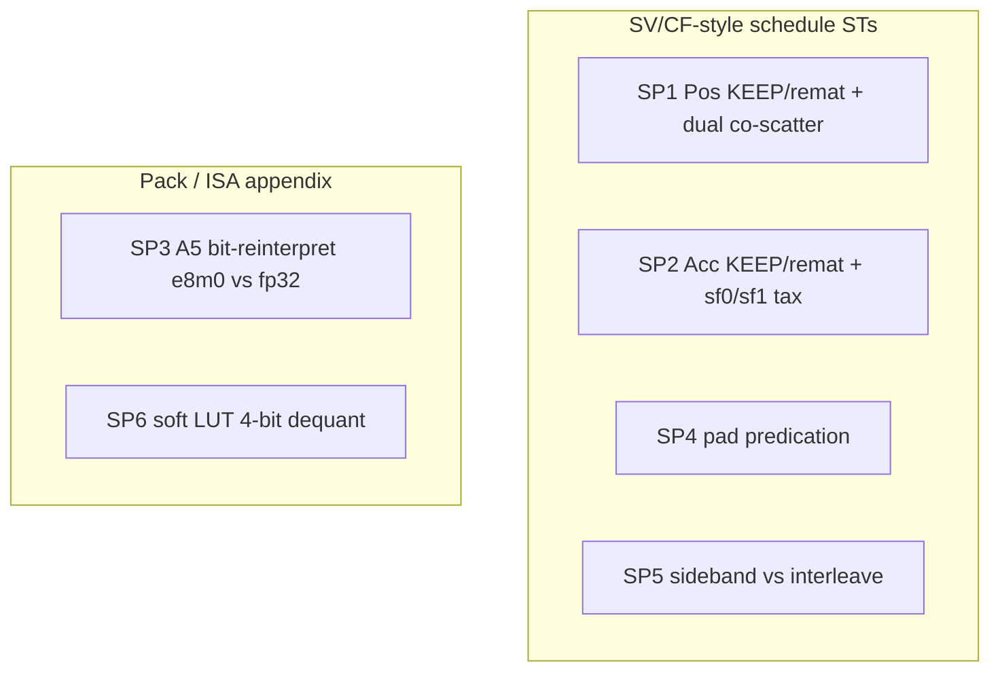

# ST-SP1 … SP6 — Single-axis schedule / pack micros (redesign)

**Date:** 2026-10-07 ~17:45 HKT  
**Suite:** `/workspace/st_simtvf_parallel`  
**Status:** Contract rewrite (Lok-approved). Simt PASS numbers historical where arms unchanged; SP3 `e8m0` = **A5 bit-reinterpret UNRUN** (soft Pow2 LUT **retired**; no native e8m0 vcvt on A5).  
**Prior design (superseded):** [`ST_SP1_SP6_ACCESS.md`](ST_SP1_SP6_ACCESS.md)  
**Contrast:** SV/CF lowering STs · MoE/SFA only as one-line remarks

---

## Design rules

1. **One lowering sensitivity per ST** (SV/CF style). Workload (MoE expand/reduce, SFA layout, MX pack) is a **one-line remark**, not the measured axis.
2. **SP3** uses **A5 bit-reinterpret e8m0→fp compose** (no soft Pow2 LUT; **no** native `vcvt f8e8m0→fp` on A5 — that is A6). Cube MX = out of scope.
3. Soft **4-bit e2m1 LUT** dequant is **SP6 only** (pack-decode appendix), not a schedule peer of SP1–SP5.
4. Prefer honest UNRUN / COMPILE_FAIL over a fake soft Pow2 LUT path.

---

## 0. Single-axis map (lead)

| ST | Single sensitivity (what we measure) | Arms | Workload remark |
|----|--------------------------------------|------|-----------------|
| **SP1** | Pos **KEEP vs remat** under dual live `(V,Sf)` + co-scatter | `keep_pos` / `remat_pos` | MoE `expand_with_sf` |
| **SP2** | Acc **KEEP vs remat** **and** **`sf0_w0` vs `sf1_w1`** (schedule arms, one case) | `keep_acc`/`remat_acc`; `sf0_w0`/`sf1_w1` under fixed Acc | MoE `reduce_fused` |
| **SP3** | fp32 SF load vs **A5 bit-reinterpret e8m0→fp compose** | `fp32` / `e8m0` | MX / UE8M0 scale path (vector decode only) |
| **SP4** | pad gather: **Simt early-skip vs Simd mask** | pad% + twin | fused alignment holes |
| **SP5** | gather **2 tensors (sideband) vs 1 slot (interleave)** | `sideband` / `interleave` | SFA scale+value layout |
| **SP6** *(appendix)* | soft **4-bit e2m1 LUT** unpack (± SF apply) | `unpack` / `unpack_sf` | FP4 value-pack decode (**not** HW; **not** schedule peer) |



**Fit with SV/CF:** SP1 ≈ SV4 index KEEP/remat + dual payload · SP2 ≈ SV3 Acc KEEP + SV4 gather (+ sf×w tax arms) · SP4 ≈ CF predication · SP5 ≈ RF/MTE schedule (1 vs 2 indexed loads) · SP3/SP6 change **encoding**, not Parallel/KEEP fold.

---

## 1. SP1 — Pos KEEP vs remat (dual co-scatter)

**Sensitivity:** index residency under dual live `(V,Sf)` + two indexed stores per live `k`.  
**Remark:** MoE `expand_to_fused_with_sf`.

```text
load V[t], Sf[t] → frags KEEP across serial(K)
keep_pos:  Pos → live; store V/Sf @ pos
remat_pos: reload Pos[t,k] each scatter
```

**Tags:** `sp1_t{T}_k{K}_h{H}_g{G}_t{Thr}_{keep_pos,remat_pos}`  
**Kernel:** `kernels/sp1_dual_scatter_vsf.py` · PTO twin `kernels_ptodsl/sp1d_dual_scatter_keep_pos.py`

| Historical PASS (2026-09-28) | µs |
|------------------------------|---:|
| `…_keep_pos` | 11.3 |
| `…_remat_pos` | 9.94 |

**Gap:** Simt `keep_pos` today uses shared `pos_row[K]` (fragment Pos KEEP failed Ascend layout). True **VRF Pos KEEP** is the intended cliff for VMI / *d remat twin — mark as gap until frag KEEP lands.

**Do not** bolt UE8M0 / col-major / FP4 onto SP1 — those stay SP3/SP5/SP6.

---

## 2. SP2 — Acc KEEP/remat **and** sf0_w0/sf1_w1 (one case)

**Sensitivity (schedule arms, same ST):**
1. Acc **KEEP vs remat/split** on indexed gather→reduce (Pos frozen; prefer `sf0_w0` when isolating Acc).
2. Under **fixed Acc KEEP**, **`sf0_w0` vs `sf1_w1`** compute tax (UB ld/st·VCI vs more ALU / SIMD bw).

**Remark:** MoE `reduce_fused` (gather by **fused slot Pos**, not expert id).  
*(Former SP2x appendix folded here — Lok 2026-10-07.)*

```text
# gold
Out[t,:] = 0
for k:
  pos = Pos[t,k]
  if pos >= 0:
    Out[t,:] += gather(Vexp[pos,:]) * (W if w1) * (Sf[pos] if sf1)
```

| Arm family | Tags | What it isolates |
|------------|------|------------------|
| Acc residency | `…_sf0_w0_{keep_acc,remat_acc}` | Acc KEEP vs remat (Pos+tax frozen) |
| Compute tax | `…_{sf0_w0,sf1_w1}_keep_*` | gather-only vs +W×Sf muls (Acc KEEP fixed) |

**Landed transitional (historical PASS):** Acc is KEEP; arms vary **Pos** keep/remat under `sf1_w1`:

| Historical PASS | µs | Note |
|-----------------|---:|------|
| `…_sf1_w1_keep_pos` | 15.66 | Acc KEEP + shared pos_row |
| `…_sf1_w1_remat_pos` | 14.5 | |

**Matrix (oneshot):** `sf0_w0_keep_acc`, `sf1_w1_keep_acc`, `sf1_w1_remat_acc`, `sf0_w0_remat_acc` + legacy Pos arms. Opsim pending.

**Kernel:** `kernels/sp2_dual_gather_wreduce.py` — CLI `sf0|sf1` × `w0|w1` × `keep_pos|remat_pos`.

---

## 3. SP3 — fp32 SF vs A5 bit-reinterpret e8m0→fp

**Sensitivity:** fp32 SF sideband load vs packed e8m0 load + **A5 bit-reinterpret compose** then group-bcast mul. Same gold `Out = V * bcast(Sf)`.  
**Remark:** MX / UE8M0 scale path (vector decode micro only).

| Arm | Load | Decode |
|-----|------|--------|
| `fp32` | `Sf[M,Hs]` float32 | none — mul only |
| `e8m0` | `Sf[M,Hs]` uint8 e8m0 exponents | **A5 bit-reinterpret:** `ui8→ui32→vshls(23)→vinterpret_cast f32` then brc+mul |

**A5 ISA (pto-isa authoritative, Ascend950PR):**
- There is **NO** dedicated `vcvt f8e8m0→fp` / TSCALE on A5. That vcvt is **A6-only** (if/when used).
- Real A5 vector path = bit-reinterpret compose (VMI):
  ```text
  vload ui8 → vcvt→ui32 → vshls(23) → vinterpret_cast→f32
  → vload(..., dist_mode="brc") + vmul
  ```
  Evidence: `pto-vmi/.../AntiMxQuantDequantKernel/..._case0_fp8_fp32_32_256.py` (`target="a5"`).  
  AscendC cousin: load as uint8 → Interleave w/ zeros → `MicroAPI::ShiftRights(..., 1)` → bf16 `2^(E−127)`.
- **Cube MX OUT OF SCOPE** for SP3 — scales stay `float8_e8m0_t` into TMATMUL_MX (no vector decode).

**Retired from SP3:** soft `Pow2[e] = reinterpret(e<<23)` **LUT table**. Soft 4-bit e2m1 LUT stays under **SP6** only.  
(Host gold may still compute `bits = e<<23; view f32` — that is bit-reinterpret, **not** a device LUT.)

**Tags:** `sp3_m{M}_h{H}_g{G}_t{Thr}_{fp32,e8m0}`  
**Kernels:** `kernels/sp3_sf_pack_ue8m0.py` (SimtVF scalar `T.reinterpret`) · `kernels_ptodsl/sp3d_sf_pack_e8m0.py` (VMI compose)

| Arm | Status | µs |
|-----|--------|---:|
| `fp32` | PASS (unchanged) | 7.39 |
| `e8m0` | **UNRUN** — bit-reinterpret source landed (SimtVF + *d); opsim not run this pass | — |
| SP3d | **full *d kernel** (not print-only stub); UNRUN until pto-b10 | — |

## 4. SP4 — Pad gather predication

**Sensitivity:** Simt early-skip vs Simd mask over pad holes.  
**Remark:** fused alignment holes from `get_fused_mapping`.

**Tags:** `sp4_e{Eexp}_h{H}_t{Thr}_pad{Pct}` · **Kernel:** `kernels/sp4_pad_gather.py`  
**Historical PASS:** `sp4_e64_h128_t32_pad25` = 11.46 µs

---

## 5. SP5 — Sideband vs interleave

**Sensitivity:** one index → **two** indexed loads (sideband) vs **one** slot load then split (interleave). Same gold.  
**Remark:** SFA / KV-ish scale+value layout.

**Tags:** `sp5_…_{sideband,interleave}` · **Kernel:** `kernels/sp5_sideband_vs_interleave.py`  
**Historical PASS:** 30.94 / 31.32 µs

---

## 6. SP6 — Soft LUT 4-bit (e2m1) dequant *(pack-decode appendix)*

**Sensitivity:** value-pack density vs **soft** nibble + e2m1 **LUT** ALU (± SF apply).  
**Not** HW `float4_e2m1x2_t` / `castFp4toBf16`. **Not** a Simt/Simd schedule peer of SP1–SP5.

| Arm | Work |
|-----|------|
| `unpack` | int8 bytes → LUT[lo/hi] → fp |
| `unpack_sf` | same + `× Sf[j//G]` |

**Tags (Simt):** `sp6_n{N}_h{H}_g{G}_t{Thr}_{unpack,unpack_sf}`  
**Kernel (Simt):** `kernels/sp6_fp4_unpack.py` (doc alias: soft LUT FP4 dequant)  
**Historical Simt PASS:** 5.35 / 11.42 µs · VF 7,813 / 18,727

### SP6d — SIMD (PTO-DSL) twin (2026-10-08)

**Kernel:** `kernels_ptodsl/sp6d_fp4_unpack.py`  
**Tags:** `sp6d_n32_h128_g32_t32_{unpack|unpack_sf}_{gather|vselr}`

| lut schedule | decode | Work |
|--------------|--------|------|
| `gather` | nibble idx → `pto.vmi.vgather(lut_ub, idx, mask)` | UB Lut[16] |
| `vselr` | `pto.vmi.vselr(table, idx)` | Lut preloaded to VL-padded VRF (lanes 0..15 live) |

Nibble path: `vload ui8 → vcvt→i32 → vand 0xF / vshr 4` (no same-width `vcvt ui32↔i32`).  
Interleave lo/hi via `vscatter` to even/odd Out lanes. SF: size=1 + `vbrc` + `vmul` (SP3d style).

| tag | status | VF_total | µs |
|-----|--------|--------:|---:|
| unpack + gather | PASS | 534 | 1.30 |
| unpack + vselr ★ | PASS | 393 | 1.22 |
| unpack_sf + gather | PASS | 826 | 1.46 |
| unpack_sf + vselr ★ | PASS | 707 | 1.40 |

Still **appendix** soft-LUT — not a schedule peer of SP1–SP5. See `PASS_TABLE_sp6d.txt`.

**HW FP4** (pto-isa `float4_e2m1x2_t`, `castFp4toBf16`) = future separate micro if needed — do **not** mix into SP6 soft LUT or SP3 e8m0.

---

## 7. Contrast vs SV (schedule)

| Axis | SV/CF | SP fill |
|------|-------|---------|
| Index KEEP/remat | SV4 | SP1 (+ dual payload) |
| Acc KEEP | SV3 | SP2 |
| Predication / mask | CF* | SP4 |
| Layout / RF·MTE | — | SP5 |
| Pack e8m0 bit-reinterpret | — | SP3 (A5 compose; A6 may add native vcvt) |
| Soft 4-bit LUT | — | SP6 appendix |
| Compute tax on gather | — | SP2 `sf0_w0`/`sf1_w1` arms |

---

## 8. Implement / land status (2026-10-07 redesign)

| ST | Kernel | Primary contract | Land status |
|----|--------|------------------|-------------|
| SP1 | `sp1_dual_scatter_vsf.py` | Pos keep/remat | PASS (keep=shared pos_row gap) |
| SP2 | `sp2_dual_gather_wreduce.py` | Acc keep/remat **+** sf0/sf1 tax | Pos+sf1_w1 PASS transitional; Acc remat + sf0_w0 **UNRUN** |
| SP3 | `sp3_sf_pack_ue8m0.py` | fp32 vs **A5 bit-reinterpret e8m0** | fp32 PASS; e8m0 **UNRUN** (source landed); soft LUT **retired** |
| SP3d | `kernels_ptodsl/sp3d_sf_pack_e8m0.py` | VMI bit-shift compose twin | **full kernel** source; **UNRUN** |
| SP4 | `sp4_pad_gather.py` | pad predication | PASS |
| SP5 | `sp5_sideband_vs_interleave.py` | sideband vs interleave | PASS |
| SP6 | `sp6_fp4_unpack.py` | soft LUT 4-bit | PASS (appendix) |
| SP6d | `kernels_ptodsl/sp6d_fp4_unpack.py` | SIMD gather / vselr LUT | **PASS** (4/4 arms; appendix) |

**Oneshot:** `oneshot_sp1_sp6.sh` · opsim: `run_opsim_generic.py` · **No invented µs** for new/changed arms.

---

## 9. Open follow-ups

1. Opsim SP3/SP3d `e8m0` bit-reinterpret on pto-b10; fix VMI binding aliases if needed (`vshls` / `vinterpret_cast` / `dist_mode=brc`).  
2. Opsim SP2 Acc×sf matrix on pto-b10; harvest PASS µs.  
3. True VRF Pos KEEP for SP1 (replace shared `pos_row`).  
4. Optional HW FP4 ST separate from SP6 soft LUT.
5. ~~SP6d SIMD twin~~ **done 2026-10-08** (gather + vselr PASS).
